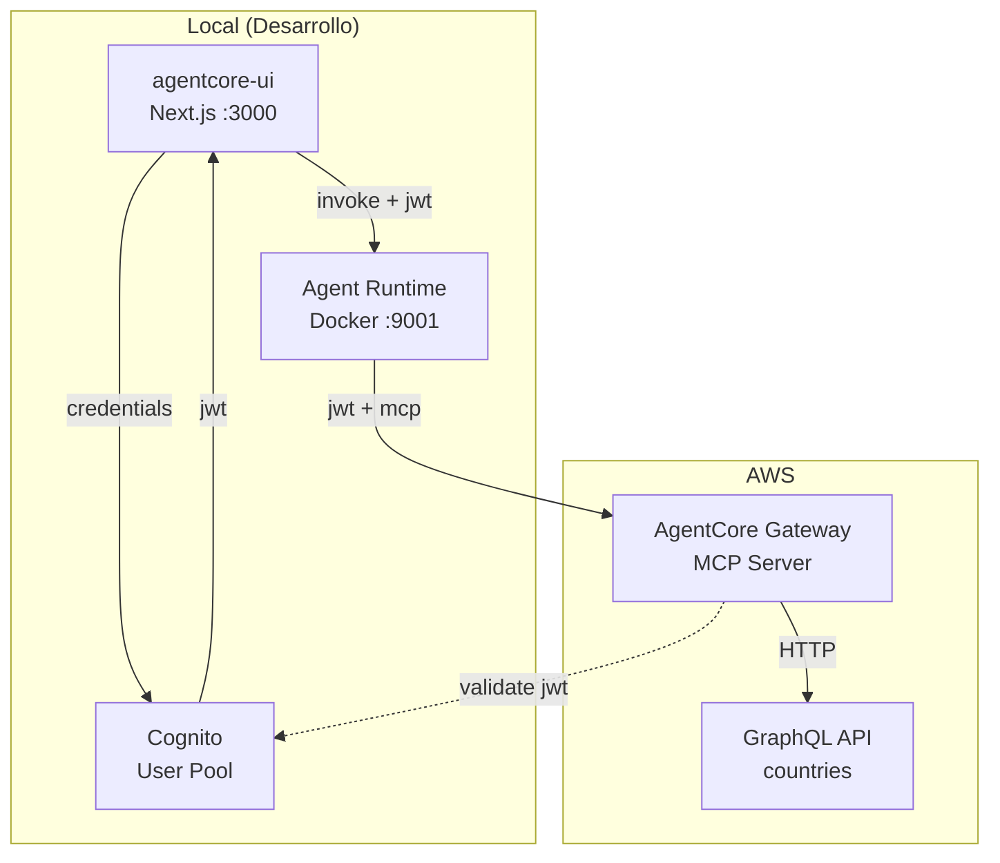

# AgentCore Demo

Demo completa de **Amazon Bedrock AgentCore** con autenticación JWT (Cognito), UI web y runtime desplegable en AWS.

## Resumen

- **agentcore-ui**: Interfaz Next.js con login usuario/contraseña vía Cognito
- **agentcore-demo-4**: Runtime con Strands Agents, BedrockModel y MCP tools (GraphQL)
- **Autenticación**: JWT de Cognito valida acceso al runtime y al Gateway
- **Modos**: Desarrollo local (Docker) o producción en AWS

---

## Arquitectura

### Diagrama Mermaid (Cognito + JWT + MCP)



### Diagrama de flujo (JWT + MCP)

```
┌─────────────────────────────────────────────────────────────────────────────────┐
│                              LOCAL (desarrollo)                                   │
│  ┌──────────────────┐                              ┌──────────────────────────┐  │
│  │  agentcore-ui    │                              │  Agent Runtime (Docker)  │  │
│  │  (Next.js)       │      credentials             │  localhost:9001          │  │
│  │  localhost:3000  │────────────────────────────►│  /invocations            │  │
│  │                  │                              │                          │  │
│  │  • Login form    │      jwt                     │  • Valida JWT            │  │
│  │  • Proxy /invoke │◄─────────────────────────────┤  • Conecta MCP Gateway   │  │
│  │                  │                              │  • Strands + Bedrock     │  │
│  └────────┬─────────┘                              └────────────┬─────────────┘  │
│           │                                                     │                │
└───────────┼─────────────────────────────────────────────────────┼────────────────┘
            │                                                     │
            │ credentials                                         │ jwt
            │                                                     │ mcp
            ▼                                                     ▼
┌───────────────────────┐                              ┌──────────────────────────┐
│      Cognito          │                              │   AgentCore Gateway     │
│  (User Pool)          │         validate jwt         │   (MCP Server)           │
│                       │◄─────────────────────────────┤                          │
│  • InitiateAuth       │     (CUSTOM_JWT)             │  • Valida JWT            │
│  • USER_PASSWORD_AUTH │                              │  • Proxy GraphQL         │
│  • JWT (id/access)    │                              └────────────┬─────────────┘
└───────────────────────┘                                           │
                                                                     │ HTTP/GraphQL
                                                                     ▼
                                                          ┌──────────────────────────┐
                                                          │   GraphQL API             │
                                                          │   (countries.trevorblades)│
                                                          └──────────────────────────┘
```

### Flujo en AWS (producción)

```
┌──────────────────┐     credentials      ┌─────────────┐
│  agentcore-ui    │────────────────────►│   Cognito   │
│  (Next.js)       │                     │             │
│                  │◄───── jwt ──────────┤             │
└────────┬─────────┘                     └─────────────┘
         │
         │ POST /invocations
         │ Authorization: Bearer <jwt>
         ▼
┌─────────────────────────────────────────────────────────┐
│  AgentCore (AWS)                                         │
│  bedrock-agentcore.us-east-1.amazonaws.com/runtimes/...  │
│                                                          │
│  • customJWTAuthorizer valida JWT con Cognito            │
│  • Pasa Authorization header al runtime                  │
└────────┬────────────────────────────────────────────────┘
         │
         │ Request al container
         │ + request_headers (Authorization)
         ▼
┌──────────────────────────┐     jwt      ┌────────────────────┐
│  Agent Runtime           │─────────────►│  AgentCore Gateway  │
│  (ECR container)         │    mcp       │  (MCP)              │
│  Strands + BedrockModel  │              │  → GraphQL target   │
└──────────────────────────┘              └────────────────────┘
```

### Flujos principales

| Paso | Descripción |
|------|-------------|
| 1 | **Login**: UI envía usuario/contraseña a `/api/auth/login` → Cognito `InitiateAuth` (USER_PASSWORD_AUTH) |
| 2 | **Token**: Cognito devuelve AccessToken/IdToken; UI lo guarda en sessionStorage |
| 3 | **Invocación**: UI envía prompt a `/api/invoke` con `Authorization: Bearer <token>` |
| 4 | **Proxy**: `/api/invoke` reenvía a runtime local o endpoint AWS con el mismo header |
| 5 | **Validación**: Runtime local (middleware) o AgentCore (customJWTAuthorizer) valida el JWT contra Cognito |
| 6 | **MCP**: Runtime conecta al AgentCore Gateway con el JWT para invocar herramientas MCP |
| 7 | **Gateway**: Gateway valida JWT (CUSTOM_JWT) y hace proxy al target GraphQL |
| 8 | **Respuesta**: Flujo inverso hasta la UI (JSON o SSE streaming) |

---

## Estructura del proyecto

```
agentcore-demo/
├── agentcore-ui/          # UI Next.js con login Cognito
│   ├── src/app/
│   │   ├── api/auth/login/   # InitiateAuth → JWT
│   │   ├── api/invoke/       # Proxy al runtime
│   │   └── page.tsx          # Login + consola
│   └── setup-env.sh          # Config .env.local (local | --aws)
│
├── agentcore-demo-4/      # Runtime AgentCore
│   ├── agent_runtime.py      # Entrypoint, RequestContext, inbound token
│   ├── runtime_mcp.py       # Cliente MCP → Gateway (JWT)
│   ├── runtime_auth.py      # Middleware JWT local
│   ├── deploy.sh            # Despliegue a AWS
│   ├── generate-cognito-token-user.sh   # Token usuario/contraseña
│   ├── .cognito-info.json   # Config Cognito
│   └── .gateway-info.json   # URL Gateway MCP
│
└── README.md              # Este archivo
```

---

## Inicio rápido

### 1. Configurar Cognito y Gateway

```bash
cd agentcore-demo-4
# Si aún no existe: ./setup-gateway-jwt.sh  # crea Gateway + Cognito
# App client debe tener ALLOW_USER_PASSWORD_AUTH
```

### 2. Desplegar runtime en AWS

```bash
cd agentcore-demo-4
./deploy.sh
```

### 3. Configurar y levantar la UI

```bash
cd agentcore-ui
./setup-env.sh --aws    # apunta al runtime en AWS
npm install && npm run dev
```

### 4. Probar

1. Abrir `http://localhost:3000`
2. Iniciar sesión con usuario/contraseña de Cognito
3. Enviar un prompt (ej: "capital de Groenlandia")
4. Revisar la respuesta

---

## Invocar desde terminal

```bash
cd agentcore-demo-4
./generate-cognito-token-user.sh USUARIO CONTRASEÑA
export TOKEN=$(jq -r '.access_token' .cognito-token.json)
agentcore invoke '{"prompt":"Hola"}' --bearer-token $TOKEN
```

---

## Alineación con la arquitectura del diagrama

| Componente | Implementado |
|------------|--------------|
| UI → Cognito (credentials) | ✅ `/api/auth/login` con InitiateAuth |
| Cognito → JWT | ✅ AccessToken/IdToken en respuesta |
| UI → Runtime (invocation + JWT) | ✅ `/api/invoke` con `Authorization: Bearer` |
| Runtime valida JWT | ✅ Local: middleware. AWS: customJWTAuthorizer |
| Runtime → Gateway (JWT, MCP) | ✅ `runtime_mcp.py` con streamablehttp_client |
| Gateway valida JWT | ✅ CUSTOM_JWT en el Gateway |
| Gateway → GraphQL | ✅ Target OpenAPI/GraphQL (countries) |

El diseño sigue el flujo: login con Cognito, token JWT para el runtime y para el Gateway, y MCP hacia el backend GraphQL.
