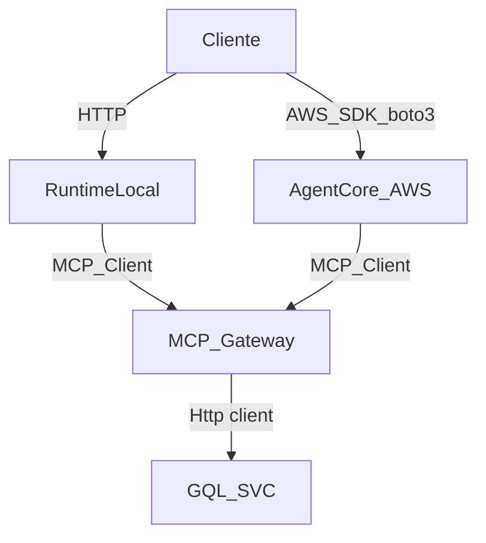

# Invocación del agente: local vs AWS

## Local (runtime en Docker)

El runtime local expone un servidor HTTP con rutas estándar de AgentCore:
- `POST /invocations`
- `GET /ping`
- `WS /ws`

### Token (Cognito)

Genera o renueva el token antes de correr el contenedor (el token expira):

```bash
./generate-cognito-token.sh
```

### Ejecutar contenedor Docker

Desde `agentcore-demo-4`:

```bash
docker run -d --rm -p 9001:8080 -p 8000:8000 \
  -e AGENTCORE_GATEWAY_URL="https://countries-gateway-fdvmwzb8ln.gateway.bedrock-agentcore.us-east-1.amazonaws.com/mcp" \
  -e AWS_REGION="us-east-1" -e AWS_PROFILE=default \
  -e OTEL_TRACES_EXPORTER=none \
  -e OTEL_LOGS_EXPORTER=none \
  -e OTEL_METRICS_EXPORTER=none \
  -v ~/.aws:/home/bedrock_agentcore/.aws:ro \
  -v "$PWD/.cognito-token.json:/app/.cognito-token.json:ro" \
  -v "$PWD/.cognito-info.json:/app/.cognito-info.json:ro" \
  -v "$PWD/.gateway-info.json:/app/.gateway-info.json:ro" \
  agentcore-demo-4
```

### Probar con `invoke_local_stream.py`

Modo interactivo (misma sesion):

```bash
.venv/bin/python invoke_local_stream.py
```

Una sola solicitud:

```bash
.venv/bin/python invoke_local_stream.py "Hola"
```

### Logs en vivo del contenedor

```bash
docker ps
docker logs -f <CONTAINER_ID>
```

Ejemplo con `curl`:

```bash
curl -X POST http://localhost:9001/invocations \
  -H "Content-Type: application/json" \
  -d '{"prompt":"Hola"}'
```

## AWS (AgentCore desplegado)

Cuando el agente está en AWS, no hay un endpoint HTTP directo como el local.
La invocación se hace con el SDK de AWS (`boto3`) contra el servicio
`bedrock-agentcore` usando el `agentRuntimeArn`.

Ejemplo con `boto3`:

```python
import boto3
import json

client = boto3.client("bedrock-agentcore", region_name="us-east-1")

response = client.invoke_agent_runtime(
    agentRuntimeArn="arn:aws:bedrock-agentcore:REGION:ACCOUNT:agent-runtime/ID",
    qualifier="DEFAULT",
    payload=json.dumps({"prompt": "Hola"})
)

print(response)
```

## Diagrama de flujo


