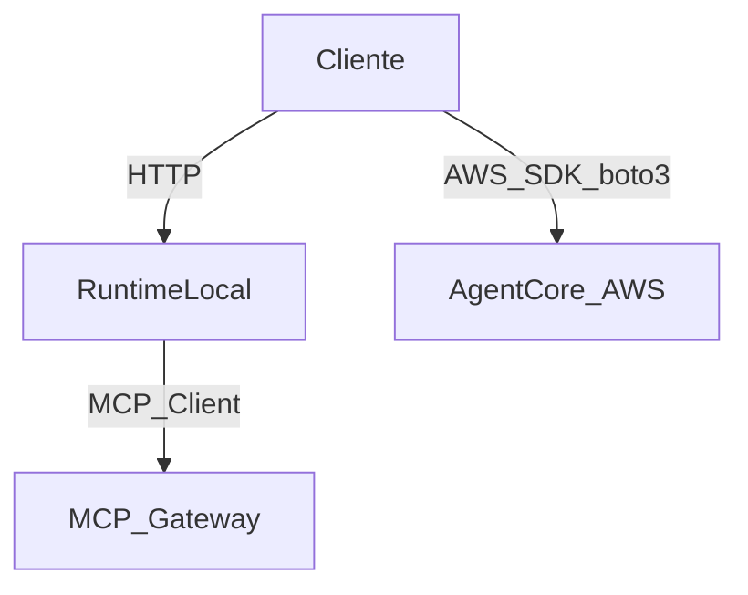

# Invocación del agente: local vs AWS

## Local (runtime en Docker)

El runtime local expone un servidor HTTP con rutas estándar de AgentCore:
- `POST /invocations`
- `GET /ping`
- `WS /ws`

Ejemplo con `curl`:

```bash
curl -X POST http://localhost:9001/invocations \
  -H "Content-Type: application/json" \
  -d '{"prompt":"Hola"}'
```

## AWS (AgentCore desplegado)

Cuando el agente está en AWS, no hay un endpoint HTTP directo como el local.
La invocación se hace con el SDK de AWS (`boto3`) contra el servicio
`bedrock-agentcore` usando el `agentRuntimeArn`.

Ejemplo con `boto3`:

```python
import boto3
import json

client = boto3.client("bedrock-agentcore", region_name="us-east-1")

response = client.invoke_agent_runtime(
    agentRuntimeArn="arn:aws:bedrock-agentcore:REGION:ACCOUNT:agent-runtime/ID",
    qualifier="DEFAULT",
    payload=json.dumps({"prompt": "Hola"})
)

print(response)
```

## Diagrama de flujo


